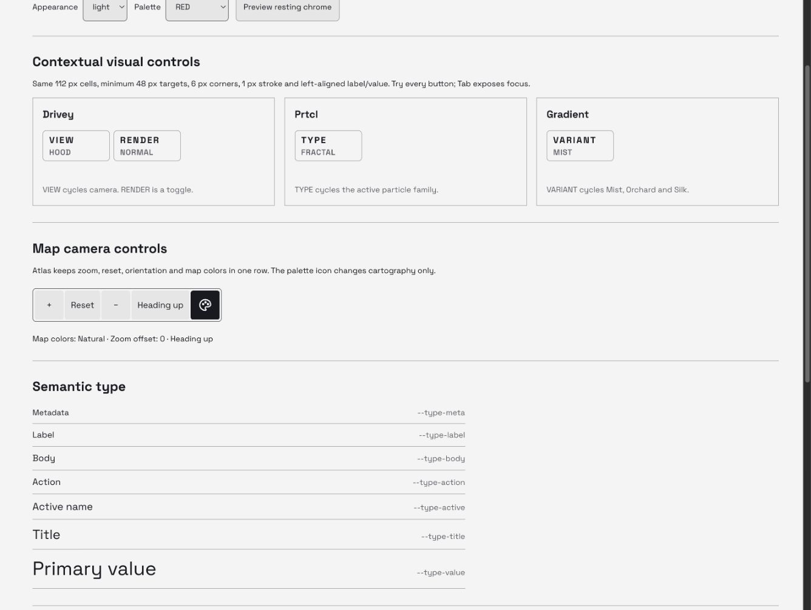

# Sedicivalvole interface system

This is the durable reference for the existing approved interface, not a new
visual direction. Keep equivalent controls consistent; preserve meaningful
roles for maps, measurements, navigation, media and decorative renderer artwork.
The owner requested this reference and a frontend consistency audit on September 12.

## Working reference and dependencies

From `prototype/drive-lab`, run the native development server with
`SEDICIVALVOLE_NO_LOCAL_ENV=1`, then open `/design-system.html` in the Codex
internal browser. The reference is development-only and is not a production entry.

| File | Owns |
| --- | --- |
| [Entry HTML](../prototype/drive-lab/design-system.html) | Standalone reference document |
| [Showcase](../prototype/drive-lab/src/design-system/showcase.jsx) | Interactive specimens and inventory from the live registries |
| [Reference CSS](../prototype/drive-lab/src/design-system/showcase.css) | Documentation layout only |
| [Shared visual controls](../prototype/drive-lab/src/ui/visual-cycle-controls.jsx) | The exact Drivey, Prtcl and Gradient controls imported by both App and showcase |
| [Atlas camera controls](../prototype/drive-lab/src/environments/atlas/atlas-camera-controls.jsx) | Shared zoom/reset/orientation and icon-only map appearance row |
| [Production CSS](../prototype/drive-lab/src/styles.css) | Type, target, border, radius, state and responsive rules |
| [Semantic colors](../prototype/drive-lab/src/semantic-theme.js) | LIGHT/DARK contrast-safe roles derived from the palette |
| [Phone layout](../prototype/drive-lab/src/phone-cockpit.css) | Safe areas and phone placement |
| [Interface contract](agent-guide/interface.md) | Approved decisions and their precedence |
| [Map contract](agent-guide/maps.md) | Map-specific geometry, attribution and data disclosure |

Change the shared owner, then inspect the reference and real application.
Do not copy specimen CSS into the product, duplicate the controls per renderer,
change upstream artwork, or use screenshots as a substitute for a live component.

## Night Instrument layer — September 24

The owner-selected [Night Instrument](NIGHT-INSTRUMENT-2026-09-24.md) layer
lives in `src/night-instrument.css` (loaded last) and the primitives in
`src/ui/night-instrument.jsx`:

| Primitive | Use |
| --- | --- |
| `--ni-plate`, `--ni-key`, `--ni-display`, `--ni-hairline`, `--ni-glow` | Plates, keys, recessed displays and lit edges, derived from the semantic roles |
| `Led`, `LedRow` | State as light: on/off, one per effect, never a fill |
| `RollingNumber`, `SpeedGauge` | Speed as odometer digits and one lit line to 130 km/h |
| `ActivityBars` | Moves only while audio actually plays |
| `VisualThumb`, `visualThumbnailUrl` | Real preview frames for visuals and destinations |
| `NiGlyph` | Original monochrome glyphs (speaker, brake, mix, visual, music, engine, palette, phone, scan) |
| `.ni-switch` | Sliding two/three-position switches with one thumb |

Motion tokens (September 24): `--ni-signal` 90 ms for values that follow live
data, `--ni-quick` 140 ms for press feedback and colour, `--ni-base` 220 ms for
surfaces arriving, `--ni-slow` 280 ms for switch thumbs, all on `--ni-ease`.
The passenger remote uses the same tokens.

Rules: one housing per group and no divider lines; keys use `--ni-key` with
10 px corners; footer keys share a 16 px label row and a 20 px value row;
animation is transform/opacity only and stops with reduced motion; keyframes
use the individual `translate`/`scale` properties so they never replace a
component's own `transform`.

## Roles and tokens

| Role | Token | Size |
| --- | --- | ---: |
| Metadata | `--type-meta` | 13 px |
| Label | `--type-label` | 14 px |
| Body | `--type-body` | 15 px |
| Action | `--type-action` | 15 px |
| Active name | `--type-active` | 17 px |
| Title | `--type-title` | 22 px |
| Primary value | `--type-value` | 32 px |

Space Grotesk is the interface face. The exact lowercase product wordmark uses
Orbitron; renderer artwork keeps its approved source treatment. Use Title Case
for editorial names, uppercase for compact functional labels. A label is not
made interactive merely because it is visually prominent. Only actual menus
use disclosure carets. Toggle state uses `aria-pressed`; a cycle announces the
current and next values in its accessible name.

## Contextual visual controls

RENDER (Drivey), TYPE (Prtcl) and VARIANT (Gradient) share these rules:

- 112 px cells; 6 px rail gap; minimum 48 px touch height;
- 6 px vertical / 10 px horizontal padding; 1 px border; 6 px corners;
- label and value share the left edge, 11 px inside the outer border;
- 15 px functional label and 13 px current value, using the shared font weights;
- LIGHT/DARK semantic foreground, surface, hover, focus and pressed roles;
- contextual actions appear when global chrome rests; awake chrome or a modal
  hides and inerts them. A deliberate field input wakes the global chrome;
- no menu caret for a direct cycle; whole-cell click/keyboard activation.

The rendered specimens measure **112 × 53 px** with the current font and line
height. The 48 px contract is a minimum, not a claim that the actual height is 48.

Map navigation and time-range controls have the same touch/border discipline
but different content geometry. Live status text is a readout, not a button.
Attribution uses readable 14 px links; Air Atlas keeps a single translucent row,
all source links, keyboard-accessible horizontal overflow on narrow screens and
an explicit rounded-area disclosure with expandable photo details. Do not hide
mandatory sources to make a screenshot look cleaner.

## Inventory of every public visual

| Visual | Local control role | Consistency boundary |
| --- | --- | --- |
| Aperture | No local cycle | Shared Visual library and chrome |
| Vertigo | No local cycle | Shared Visual library and chrome |
| Meridian | No local cycle | Shared Visual library and chrome |
| Atlas | Map/navigation/place controls | Map geometry, truthful location/readouts, shared semantic type |
| Drivey | RENDER | Shared visual control module |
| Prtcl | TYPE | Shared visual control module |
| Discover | Search, language, article/navigation | Passenger modal; labels remain subordinate to content |
| Gradient | VARIANT: Mist, Orchard, Silk | Shared visual control module; one catalogue family |
| Stats for Nerds | Time ranges and observations | Measurements are readouts; range actions retain target size |
| Air Atlas | Traffic, labels, map, heading, zoom and flight | Map controls; fixed attribution/source and freshness semantics |

## September 12 audit evidence

Scope: catalogue naming, contextual label geometry and interaction states,
LIGHT/DARK color roles, compact map credits, and responsive specimens. This is
not a complete accessibility certification or a review of every passenger flow.

1. **Catalogue:** current app capture shows all ten public choices using one
   consistent card pattern and editorial names. Gradient remains one family.
   Air Atlas's longer description wraps deliberately; no text is shrunk to fit.
2. **Contextual controls:** the production components, moved unchanged from
   App into their shared module, have identical measured width, padding, border,
   corners, label/value sizes and left baseline. VIEW/RENDER, TYPE and VARIANT
   operate through their existing model functions. The active RENDER toggle
   inverts with correct semantic colors; the other controls remain cycles.
3. **Appearance and keyboard:** LIGHT/RED and DARK/PEARL specimens preserve
   geometry and legible state contrast. Tab reaches the controls and presents
   a visible two-pixel focus outline. Resting chrome makes every rail hidden
   with `pointer-events: none`, removing hidden controls from interaction.
4. **Air Atlas:** a visibly identified local fixture renders four separated
   aircraft. At 773 × 601 all five normal source credits fit their single row;
   14 px text sits on 72%-opaque dark backing. The row is about 25.6 px high.
   The disclosure opens above it without moving the map. Narrow screens and
   additional Fly With attribution use horizontal source scrolling.

5. **Passenger/readout roles:** Stats' no-GPS screen keeps 13 px metadata,
   22 px title and 32 px primary values separate from its range action. Discover's
   current no-location screen uses uppercase actions and a contiguous scope rail;
   its shared edges remain square to express one navigation group. It does not
   duplicate the floating visual-cycle geometry. Atlas' permission state and explicit Milan demo were inspected without
   granting device location. Its framing and camera groups meet the 48 px target
   with 4 px inner corners inside 6 px containers; map-source labels remain separate.
6. **Production integration:** the packaged app launches Orchard at 773 × 601,
   wakes its contextual controls and changes to Silk through the real VARIANT
   action. REPORT shows the intended build/source and zero runtime issues.

**Owner-selected correction — Atlas MAP COLOR (F07):** the audit found a separate
legacy two-line plaque with 2 px corners and asymmetric padding. The owner
explicitly replaced that direction with an icon in the zoom row. The shared
`AtlasCameraControls` now contains zoom, reset, orientation and the existing
pinned palette icon. Each action retains a 48 px minimum target; the icon is
24 px within a 48 × 48 px button. Both control groups align at the same height
where width permits; below 620 px they stack without shrinking targets. The
accessible name describes current and next colors, `aria-pressed` identifies
Natural, and native pointer/keyboard activation uses the existing map-paint path.
The live reference uses this exact production component, with a synthetic zoom
readout and no map or geographic requests. Real-map pointer and keyboard changes,
LIGHT/DARK selected states, aligned group coordinates and a 357 px-wide specimen
without horizontal overflow were verified in the internal browser.

The confirmed strengths are shared contextual geometry and state semantics. The maintenance
risk was that the controls lived inside the large App module, without a runnable
reference; the shared module and live showcase address that risk. Remaining
scope includes screen-reader and physical touch checks, real-device readability,
and full passenger-flow acceptance. The shared visual cells are unchanged; the Atlas icon placement follows the explicit owner correction.

Temporary source captures and Gradient before/after evidence are retained under
`prototype/drive-lab/output/playwright/followups-20260912/` when available. They
contain synthetic inputs only and are not public application fixtures.

## Review when adding a visual

Use the existing family/visual registry and shared library cards. If a local
cycle is needed, reuse the shared control structure and model-owned transitions.
Check compact 773 × 601, short desktop and phone landscape, both appearances,
all affected palettes, selected/hover/focus states, retraction and modal behavior.
Distinguish action labels from passive telemetry; verify names, focus and actual
outcomes as well as screenshots. Record exceptions beside their surface contract.

## Stable identity and contextual action lane — September 19

The owner explicitly delegated this refinement. The earlier map-only rule hiding
its logo is rejected and superseded. Identity may never be removed to conceal a
collision. This also supersedes the old moving speed-only rail.

- `App.jsx` places the logo, speed and mode selector in actual adjacent grid cells.
  The bar remains 64 px high, or 56 px for the phone shell. The larger transparent
  piston mark uses 60 px artwork (52 px compact); it is never stretched.
- `contextual-rail.css` owns shared identity widths, safe-area insets and the gap
  to the right-hand action lane. `ContextualRail` is the common container for
  visual cycles, Atlas, radar, Fly With and Engine profiles. No renderer guesses
  the logo or speed coordinates independently.
- Groups align to the right and wrap by intrinsic content width, retaining 48 px
  targets, 6 px corners, the semantic type ladder and LIGHT/DARK surfaces. Atlas
  keeps framing separate from its camera group. Radar keeps observation text and
  its open aircraft list below its actions. No list or readout overlays a button.
- Awake global chrome hides and inerts contextual actions. The essential RADAR
  return and terrain recovery remain reachable below the awake header. Resting
  chrome gives that lane back to the complete flight toolbar. Real modals suppress
  both identity and field actions through the existing modal boundary.
- Engine keeps its approved RPM / speed / gear instrument. Its navbar also keeps
  the same compact speed reference as all other modes; both use the same speed
  and source, and show a dash for unknown GPS evidence. Profiles use the common
  upper action lane; stationary TAMARRO retains its existing separate role.
- The running app clips its overflow without becoming a scroll container. This
  prevents focus/scroll anchoring from shifting the entire field when controls
  retract; drawers retain their own explicit scroll containers.

The 48 px project target exceeds the 44 px size described in
[W3C target-size guidance](https://www.w3.org/WAI/WCAG22/Understanding/target-size-enhanced.html).
Visible, unobscured keyboard focus follows the concern described in
[W3C focus guidance](https://www.w3.org/WAI/WCAG22/Understanding/focus-not-obscured-minimum.html).
These references inform the checks; this is not a WCAG conformance claim.

Current screenshots and geometric evidence belong to
[the September 19 harmony audit](qa/2026-09-19-ui-harmony/README.md).
Historical September 12 screenshots above describe that earlier revision.

## Equal Engine evidence cells — September 19

The annotated RPM/speed/gear band uses three equal columns and identical four-row
geometry: 13 px label, one shared responsive numeric size, 13 px status and one
micro-signal window. All content aligns left. The speed cell remains a real
button with visible keyboard focus; its display semantics match the passive
cells. At short phone height every numeric value is 48 px and compact truthful
status labels fit above a 16 px signal.

Micro-signals communicate virtual RPM/load, observed speed and virtual shift
phases through different encodings, without random activity. See the
[Engine contract](agent-guide/engine.md#equal-telemetry-cells-and-live-micro-signals)
and [rendered evidence](qa/2026-09-19-engine-cells/README.md). Continuous travel
respects [W3C reduced-motion guidance](https://www.w3.org/WAI/WCAG21/Techniques/css/C39.html);
the silent development bench uses [requestAnimationFrame](https://developer.mozilla.org/en-US/docs/Web/API/Window/requestAnimationFrame)
with a hidden-page time hold. The production plots use CSS transforms with no
additional animation scheduler.
