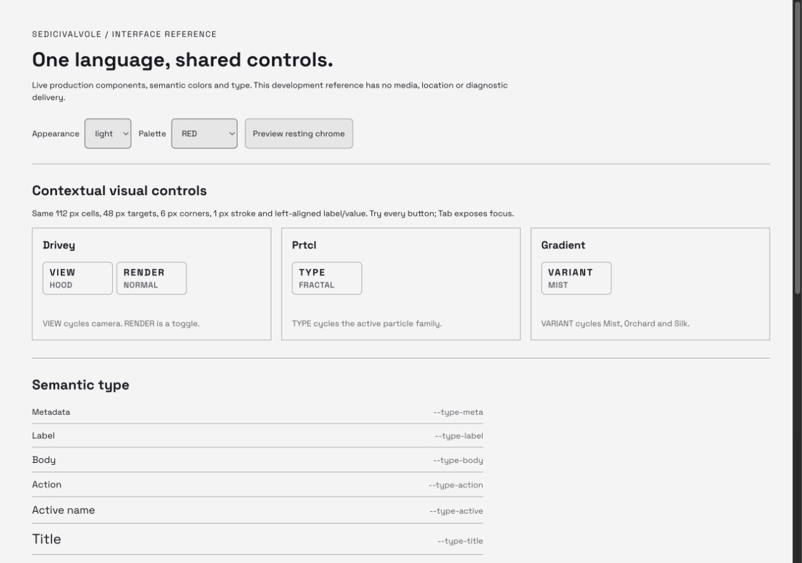
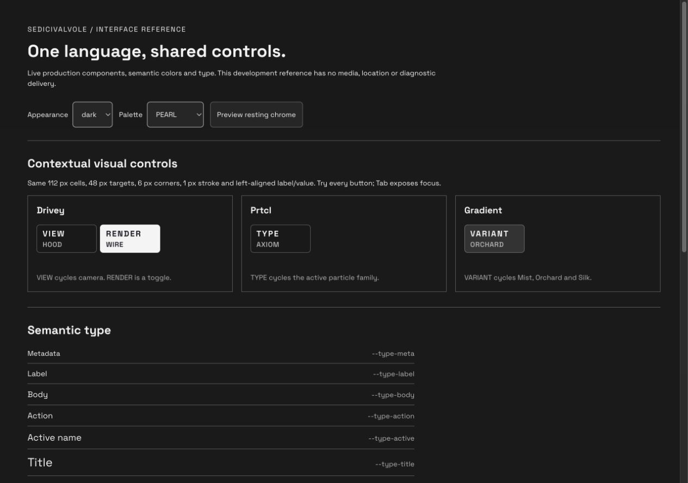

# Sedicivalvole interface system

This is the durable reference for the existing approved interface, not a new
visual direction. Keep equivalent controls consistent; preserve meaningful
roles for maps, measurements, navigation, media and decorative renderer artwork.
The owner requested this reference and a frontend consistency audit on September 12.

## Working reference and dependencies

From `prototype/drive-lab`, run the native development server with
`SEDICIVALVOLE_NO_LOCAL_ENV=1`, then open `/design-system.html` in the Codex
internal browser. The reference is development-only and is not a production entry.

| File | Owns |
| --- | --- |
| [Entry HTML](../prototype/drive-lab/design-system.html) | Standalone reference document |
| [Showcase](../prototype/drive-lab/src/design-system/showcase.jsx) | Interactive specimens and inventory from the live registries |
| [Reference CSS](../prototype/drive-lab/src/design-system/showcase.css) | Documentation layout only |
| [Shared visual controls](../prototype/drive-lab/src/ui/visual-cycle-controls.jsx) | The exact Drivey, Prtcl and Gradient controls imported by both App and showcase |
| [Production CSS](../prototype/drive-lab/src/styles.css) | Type, target, border, radius, state and responsive rules |
| [Semantic colors](../prototype/drive-lab/src/semantic-theme.js) | LIGHT/DARK contrast-safe roles derived from the palette |
| [Phone layout](../prototype/drive-lab/src/phone-cockpit.css) | Safe areas and phone placement |
| [Interface contract](agent-guide/interface.md) | Approved decisions and their precedence |
| [Map contract](agent-guide/maps.md) | Map-specific geometry, attribution and data disclosure |

Change the shared owner, then inspect the reference and real application.
Do not copy specimen CSS into the product, duplicate the controls per renderer,
change upstream artwork, or use screenshots as a substitute for a live component.

## Roles and tokens

| Role | Token | Size |
| --- | --- | ---: |
| Metadata | `--type-meta` | 13 px |
| Label | `--type-label` | 14 px |
| Body | `--type-body` | 15 px |
| Action | `--type-action` | 15 px |
| Active name | `--type-active` | 17 px |
| Title | `--type-title` | 22 px |
| Primary value | `--type-value` | 32 px |

Space Grotesk is the interface face. The exact lowercase product wordmark uses
Orbitron; renderer artwork keeps its approved source treatment. Use Title Case
for editorial names, uppercase for compact functional labels. A label is not
made interactive merely because it is visually prominent. Only actual menus
use disclosure carets. Toggle state uses `aria-pressed`; a cycle announces the
current and next values in its accessible name.

## Contextual visual controls

VIEW / RENDER (Drivey), TYPE (Prtcl) and VARIANT (Gradient) share these rules:

- 112 px cells; 6 px rail gap; minimum 48 px touch height;
- 6 px vertical / 10 px horizontal padding; 1 px border; 6 px corners;
- label and value share the left edge, 11 px inside the outer border;
- 15 px functional label and 13 px current value, using the shared font weights;
- LIGHT/DARK semantic foreground, surface, hover, focus and pressed roles;
- deliberate input wakes chrome; all these controls retract together at rest
  or beneath a modal and become non-interactive when hidden;
- no menu caret for a direct cycle; whole-cell click/keyboard activation.

The rendered specimens measure **112 × 53 px** with the current font and line
height. The 48 px contract is a minimum, not a claim that the actual height is 48.

Map navigation and time-range controls have the same touch/border discipline
but different content geometry. Live status text is a readout, not a button.
Attribution uses readable 14 px links; Air Atlas keeps a single translucent row,
all source links, keyboard-accessible horizontal overflow on narrow screens and
an explicit rounded-area disclosure with expandable photo details. Do not hide
mandatory sources to make a screenshot look cleaner.

## Inventory of every public visual

| Visual | Local control role | Consistency boundary |
| --- | --- | --- |
| Aperture | No local cycle | Shared Visual library and chrome |
| Vertigo | No local cycle | Shared Visual library and chrome |
| Meridian | No local cycle | Shared Visual library and chrome |
| Atlas | Map/navigation/place controls | Map geometry, truthful location/readouts, shared semantic type |
| Drivey | VIEW and RENDER | Shared visual control module |
| Prtcl | TYPE | Shared visual control module |
| Discover | Search, language, article/navigation | Passenger modal; labels remain subordinate to content |
| Gradient | VARIANT: Mist, Orchard, Silk | Shared visual control module; one catalogue family |
| Stats for Nerds | Time ranges and observations | Measurements are readouts; range actions retain target size |
| Air Atlas | Traffic, labels, map, heading, zoom and flight | Map controls; fixed attribution/source and freshness semantics |

## September 12 audit evidence

Scope: catalogue naming, contextual label geometry and interaction states,
LIGHT/DARK color roles, compact map credits, and responsive specimens. This is
not a complete accessibility certification or a review of every passenger flow.

1. **Catalogue:** current app capture shows all ten public choices using one
   consistent card pattern and editorial names. Gradient remains one family.
   Air Atlas's longer description wraps deliberately; no text is shrunk to fit.
2. **Contextual controls:** the production components, moved unchanged from
   App into their shared module, have identical measured width, padding, border,
   corners, label/value sizes and left baseline. VIEW/RENDER, TYPE and VARIANT
   operate through their existing model functions. The active RENDER toggle
   inverts with correct semantic colors; the other controls remain cycles.
3. **Appearance and keyboard:** LIGHT/RED and DARK/PEARL specimens preserve
   geometry and legible state contrast. Tab reaches the controls and presents
   a visible two-pixel focus outline. Resting chrome makes every rail hidden
   with `pointer-events: none`, removing hidden controls from interaction.
4. **Air Atlas:** a visibly identified local fixture renders four separated
   aircraft. At 773 × 601 all five normal source credits fit their single row;
   14 px text sits on 72%-opaque dark backing. The row is about 25.6 px high.
   The disclosure opens above it without moving the map. Narrow screens and
   additional Fly With attribution use horizontal source scrolling.

The confirmed strengths are shared geometry and state semantics. The maintenance
risk was that the controls lived inside the large App module, without a runnable
reference; the shared module and live showcase address that risk. Remaining
scope includes screen-reader and physical touch checks, real-device readability,
and full passenger-flow acceptance. No new visual treatment was introduced.

Temporary source captures and Gradient before/after evidence are retained under
`prototype/drive-lab/output/playwright/followups-20260912/` when available. They
contain synthetic inputs only and are not public application fixtures.

## Review when adding a visual

Use the existing family/visual registry and shared library cards. If a local
cycle is needed, reuse the shared control structure and model-owned transitions.
Check compact 773 × 601, short desktop and phone landscape, both appearances,
all affected palettes, selected/hover/focus states, retraction and modal behavior.
Distinguish action labels from passive telemetry; verify names, focus and actual
outcomes as well as screenshots. Record exceptions beside their surface contract.
