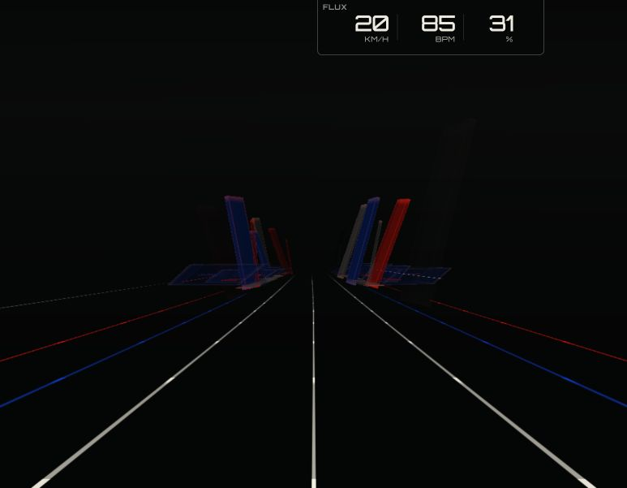
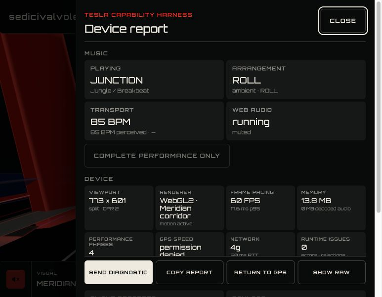
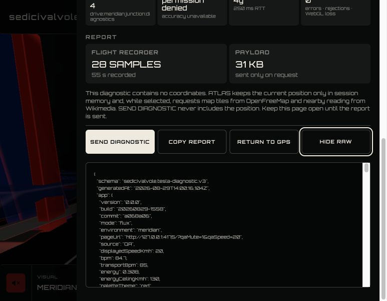
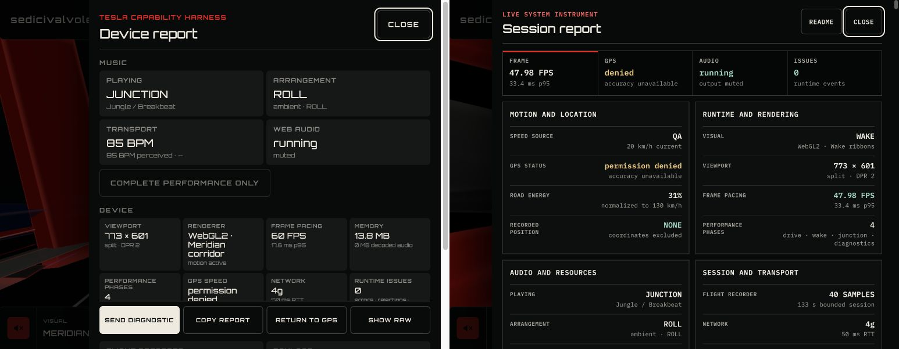
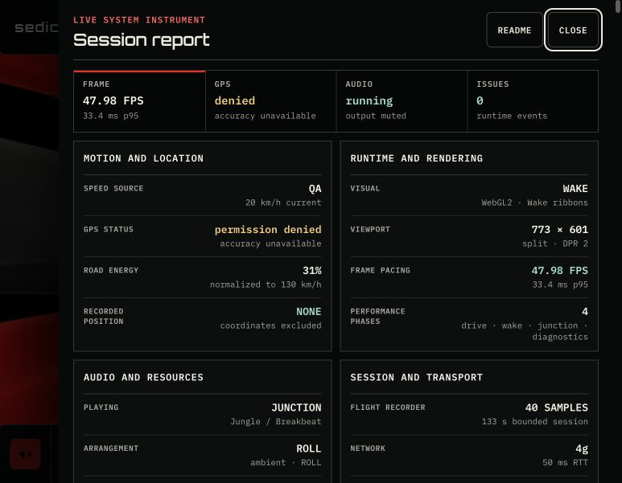
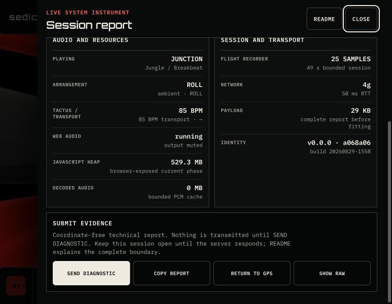
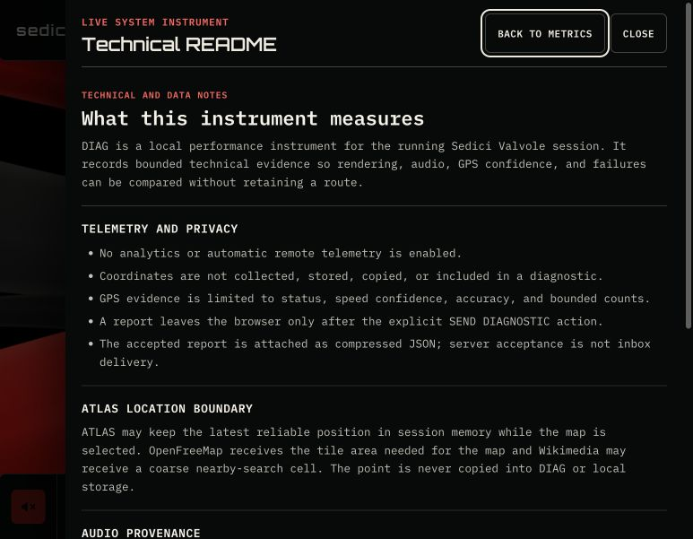
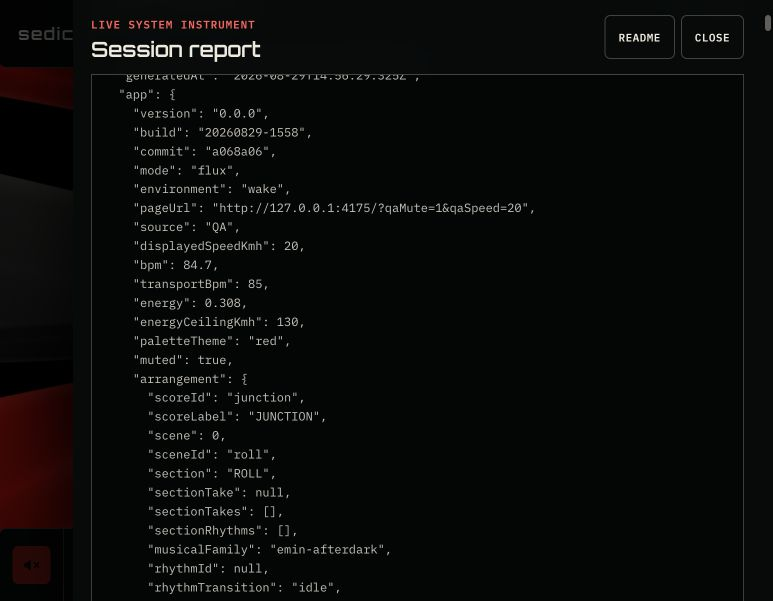

# DIAG product audit — 2026-08-29

Status: **audit complete; redesigned local flow passed the 773 × 601 desktop gate**.

## Audit scope

- Surface: the integrated DIAG flow in the current `a068a06` source state.
- User goal: inspect real music, renderer, frame-pacing, memory, GPS, network,
  runtime and flight-recorder evidence quickly at the Tesla split viewport.
- Accessibility target: keyboard-operable, readable at `773 × 601`, and usable
  without hiding information required for an informed diagnostic submission.
- Capture: muted local Vite build at `773 × 601` CSS pixels, DPR `2`, using
  `?qaMute=1&qaSpeed=20`. No sound was played and no diagnostic was sent.

## Flow evidence

### Step 1 — Signal Gate

Health: **good**. The single launch action, credits and local-processing note
are readable and the user can understand that the gesture initializes the
experience.

### Step 2 — Running experience

Health: **good with discoverability limits**. The retracted chrome preserves
the quiet field, but DIAG is reachable only after a wake interaction. The first
wake gesture correctly restores controls without changing the driving state.

### Step 3 — Operational DIAG overview

Health: **functional but hard to scan**. The current panel contains real
evidence and keeps the action row reachable, but typography, density and the
sticky tray compete with the metrics at the target viewport.

### Step 4 — Raw report

Health: **complete but difficult to read**. The JSON remains available and is
not substituted by a summary, but the nested scrolling surface, 9 px type and
long wrapped lines make technical inspection unnecessarily slow.

## Confirmed strengths

- The dialog has a semantic name, an explicit close control and a logical
  heading sequence.
- `Escape` closes the panel and restores focus to the DIAG trigger.
- The four 48 px actions remain reachable at the Tesla split viewport.
- Music, frame pacing, memory, GPS, network, runtime issues and flight-recorder
  evidence are present instead of being replaced by decorative UI.
- Unsupported memory and denied location states are stated rather than
  fabricated.
- The report contains no coordinates and no remote transmission occurs without
  the explicit `SEND DIAGNOSTIC` action.
- The captured flow produced no browser console warning or error.

## UX risks

1. **P1 — Operational evidence is visually dense.** Orbitron is used for every
   reading at `9–14 px`, including multi-line renderer, phase and GPS values.
   Wide geometric forms and tight line height slow scanning in the exact place
   where compact technical text must be fast to parse.
2. **P1 — The privacy explanation consumes the operational surface.** Four
   lines of persistent explanatory copy push the report and actions lower even
   though the same material belongs in a dedicated README/privacy panel. The
   submission boundary still needs one concise disclosure next to SEND.
3. **P2 — Sticky actions obscure context.** The action tray overlaps the lower
   metric region while scrolling, so values can disappear behind controls even
   though the buttons themselves remain reachable.
4. **P2 — Information hierarchy follows implementation groups more than scan
   priority.** Music receives four large cards while GPS denial, runtime issues,
   memory and frame pacing compete inside a dense four-column matrix.
5. **P2 — Disabled `COMPLETE PERFORMANCE ONLY` consumes a full row.** It is
   accurate for JUNCTION but behaves like a primary action while providing no
   action in the current state.
6. **P2 — Raw evidence has two scroll contexts.** The drawer scroll and the raw
   report scroll coexist, increasing touch friction and making position hard to
   track.

## Accessibility risks

- Several secondary labels use low-opacity grey at `9 px`; screenshot evidence
  indicates a likely text-contrast and legibility risk, but computed contrast
  and text-zoom behavior still require browser measurement.
- The 48 px action targets are strong, but the four-column evidence cards make
  long values wrap into cramped two- and three-line blocks.
- Raw JSON is technically keyboard reachable, yet the 9 px size and nested
  scrolling make it a poor low-vision inspection surface.
- Screenshot evidence cannot prove screen-reader reading order, complete focus
  trapping, 200% zoom resilience or reduced-motion behavior. Those remain
  implementation tests for the redesign.

## Redesign requirements

1. Use a highly readable open-licensed monospaced face for diagnostic content;
   keep Orbitron only for product identity and compact operational accents.
2. Lead with a concise health strip, then prioritize motion/GPS, runtime,
   audio and resource evidence in a stable scan order.
3. Replace cramped four-column cards with aligned label/value rows or a mixed
   two-column evidence grid that tolerates real long values.
4. Move the complete privacy, telemetry, provenance, licensing and source
   explanation into a dedicated accessible README panel.
5. Keep a short informed-submission disclosure adjacent to SEND, including the
   coordinate-free and explicit-gesture facts.
6. Remove the inert JUNCTION audition row from the operational path; expose
   audition only where it can perform a real action.
7. Give raw JSON one readable full-width region with larger type, line-number or
   key rhythm, and one scroll context.
8. Preserve every current real metric and the explicit no-coordinate boundary.

## Implemented redesign evidence

The redesign was checked against the original capture in one side-by-side
comparison at the same `773 × 601` viewport and the same muted 20 km/h QA state.

### Operational overview

- IBM Plex Mono Regular and SemiBold carry measurements and technical copy;
  Orbitron remains limited to product identity and the report title.
- A four-cell health strip exposes frame pacing, GPS state, audio state and
  issue count before the detailed two-column instrument grid.
- Metric labels and tabular values use aligned definition lists. Long technical
  states wrap at word boundaries instead of breaking arbitrary glyph groups.
- The action row participates in normal document flow and no longer obscures
  lower evidence.

### Actions and informed submission

The operational panel keeps only the coordinate-free, explicit-gesture and
server-versus-inbox boundary beside `SEND DIAGNOSTIC`. The four 48 px controls
remain available without a sticky overlay. The inert JUNCTION audition row is
absent; the audition action appears only for FRACTURE, where it performs a real
transition.

### Dedicated technical README

The accessible README control opens telemetry and privacy boundaries, ATLAS
location handling, audio provenance and ownership status, project and font
licensing, source links, and build identity. Information essential to informed
submission remains beside the send action instead of being hidden here.

### Raw report

Raw JSON now uses 12 px IBM Plex Mono, visible overflow inside the drawer's one
scroll context, and no independent nested scroller. The complete evidence is
retained rather than summarized away.

## Redesign verification

- Browser-computed font: `IBM Plex Mono`; raw report size: `12px`.
- Drawer overflow: `auto`; raw report overflow: `visible`; the drawer is the
  only scrollable diagnostic surface.
- Keyboard `Tab` reached the next control with a visible solid focus outline.
- `Escape` closed the dialog and the semantic dialog count returned to zero.
- No browser warning or error was captured during overview, README, raw-report,
  scroll or keyboard checks.
- Presentation tests assert submission disclosure, non-sticky actions, aligned
  instrument layout, README content, single-scroll raw evidence and the exact
  packaged IBM Plex Mono files plus OFL notice.

### Difference triage

- **P0:** none.
- **P1:** the typography, operational density and displaced privacy explanation
  findings are resolved in the local build.
- **P2:** sticky overlap, implementation-led grouping, inert action and nested
  raw scrolling findings are resolved in the local build.
- **Open device gate:** real Tesla touch, cabin scan distance, font rendering,
  screen-reader behavior and 200% text zoom are not accepted by desktop QA.

## Evidence limits

This is a combined UX and screenshot-based accessibility audit. It does not
claim WCAG conformance or target-Tesla acceptance. The source ran on desktop at
the Tesla CSS viewport with DPR `2`; real vehicle DPR, touch, font rendering,
screen-reader behavior and cabin scan distance remain separate gates.
